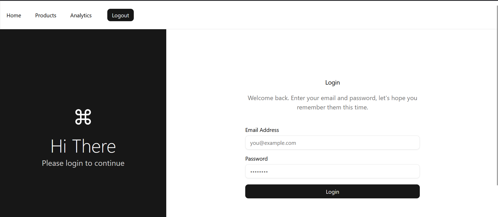
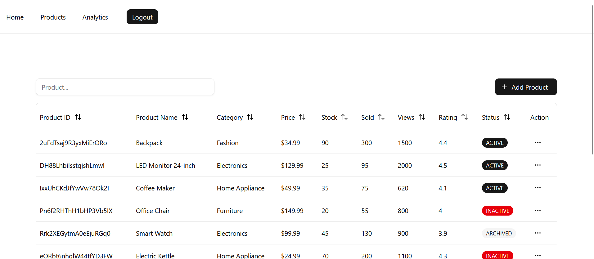
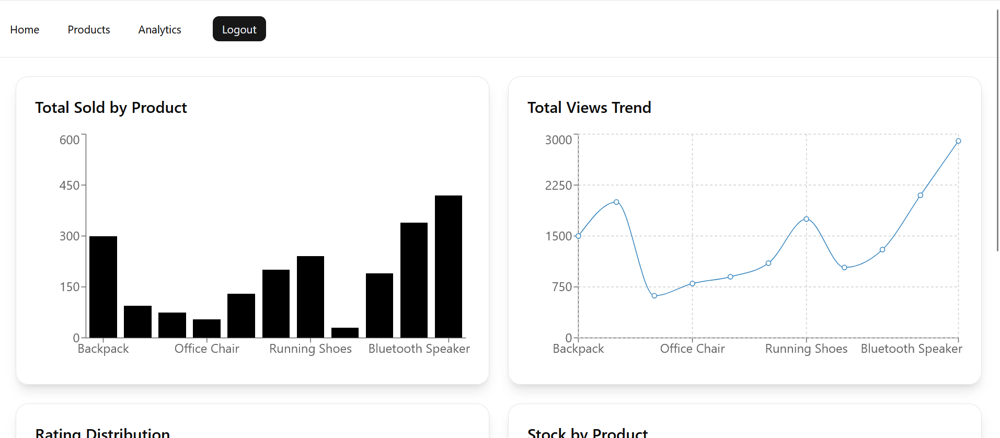

# Product Management Frontend


## Run Locally

Clone the project

```bash
  git clone https://github.com/VoidAshfak/product-dashboard-backend.git
```

Go to the project directory

```bash
  cd product-dashboard-backend
```

Install dependencies

```bash
  npm install
```

Start the server

```bash
  npm run dev
```


## Deployment

To deploy this project run

```bash
  npm run build
```

## Environment Variables

To run this project, you will need to add the following environment variables to your .env file

`NEXT_PUBLIC_BASE_API_URL`


`NEXT_PUBLIC_FIREBASE_API_KEY`


`NEXT_PUBLIC_FIREBASE_AUTH_DOMAIN`


`NEXT_PUBLIC_FIREBASE_PROJECT_ID`


`NEXT_PUBLIC_FIREBASE_STORAGE_BUCKET`


`NEXT_PUBLIC_FIREBASE_MESSAGING_SENDER_ID`


`NEXT_PUBLIC_FIREBASE_APP_ID`


`NEXT_PUBLIC_FIREBASE_MEASUREMENT_ID`


## Tech Stack

####  Framework & Language

- Next.js 16 (App Router)
- React 19
- TypeScript
####  State Management & Data Fetching

- Redux Toolkit
- RTK Query

####  Forms & Validation

- React Hook Form
- Zod + RHF integration
####  UI Components / Styling
- ShadCN UI
- Tailwind CSS
####  Data Table
- ShadCN UI
- Tailwind CSS
####  Database & Real-Time Data
- Firebase Firestore Client SDK (Can be implemented via Backend api. But good for now)


## Demo

https://product-dashboard-frontend-beryl.vercel.app/

## Screenshots





